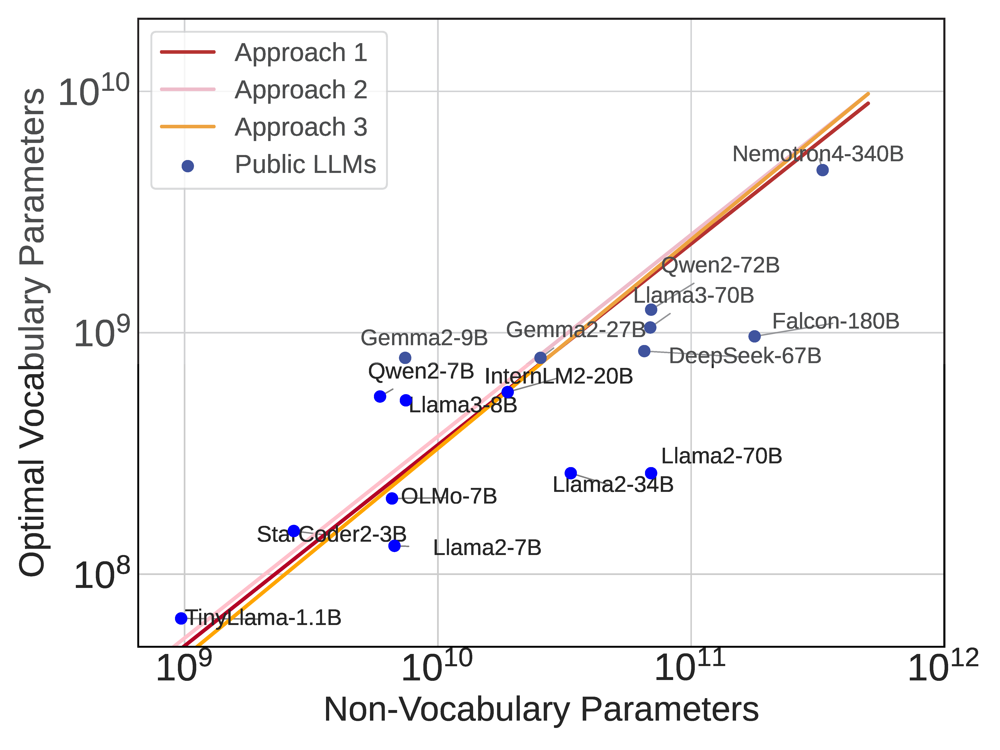

# Scaling Laws with Vocabulary: Larger Models Deserve Larger Vocabularies

## Abstract
We investigate how vocabulary size impacts language model scaling laws by training models ranging from 33M to 3B parameters on up to over 500B characters with various vocabulary configurations. **We find that the optimal vocabulary depends on the compute budget**, thus we propose three approaches to determine it. All approaches suggest that **vocabulary parameters should be scaled slower than non-vocabulary parameters**. Nonetheless, vocabulary parameters are critical for performance and under-allocated in current LLMs. By adopting the vocabulary size predicted by our method instead of the conventional setting, we train better 3B parameter models  in cases when the number of training data is 1) insufficient; 2) optimally allocated by compute budget; 3) overly sufficient. Our work reveals the underestimated role of vocabulary, and the necessity of jointly considering vocabulary size, model parameters, and training data for efficient scaling.

<br>
<!--  -->
<p float="left">
  
  
</p>

**Left:** The relationship between non-vocabulary and vocabulary parameters follows a power law (the scaling proportion $\gamma < 1$ ). Empirical results show that non-vocabulary parameters should scale slower than vocabulary parameters, with larger circles indicating higher loss values.  **Right:** Most existing LLMs have suboptimal vocabulary parameters due to vocabulary sizes, which are smaller than the expected optimal values given the non-vocabulary parameters. 

## Code Description
This repository contains the implementation of three approaches to predict the optimal vocabulary size for language models:

1. **Approach 1: Build the relationship between studied attributes and FLOPs**: Build the relationship between the optimal data points (the points that reach the lowest loss under the same FLOPs budget) and the FLOPs.
2. **Approach 2: Derivative-Based Estimation**: Fast calculation method using the derivative of FLOPs with respect to the vocabulary size.
3. **Approach 3: Parametric Fit of Loss Formula**: Design a loss formula that considers the effect of vocabulary size and utilizes the loss to make prediction.


Instead of the commonly-used language modeling loss, we adopt Unigram-Normalized language modeling loss  $\mathcal{L}_u$ , is basically vocabulary-insensitive. Therefore, the metric can be used to evaluate the language models with different vocabulary sizes fairly. Please see the paper for details.

We upload the data recorded during our experiments in ```exp_data.csv```, which are used for fitting.  We launch a series of models with the non-vocabulary parameters fixed and vocabulary
sizes varying from 4K to 96K. The training curve envelope of the experiments is shown:
<!--  -->


## Install the required dependencies
```
pip install -r requirements.txt
```

## Usage
We can directly use python to run the scripts for reproducing the fitting process of each apporach to predict the optimal vocabulary paramaeters and vocabulary size.
```
python approach1_isoflops.py
python approach2_derivative.py
python approach3_isoloss.py
```

Or we can directly predict the optimal vocabulary paramaeters and size by the following script, using the coefficients fitted in the proposed 3 aforementioned approaches.
```
python optimal_Nv_predict.py
```

## Full Experiments
To reproduce the  full experiments of language modeling training, please see the [Experiments README](experiments/README.md) for details.

## Citation

If you use this work in your research, please cite

```
@article{tao2024scaling,
  title={Scaling Laws with Vocabulary: Larger Models Deserve Larger Vocabularies},
  author={Tao, Chaofan and Liu, Qian and Dou, Longxu and Muennighoff, Niklas and Wan, Zhongwei and Luo, Ping and Lin, Min and Wong, Ngai},
  journal={arXiv preprint arXiv:2407.13623},
  year={2024}
}
```
